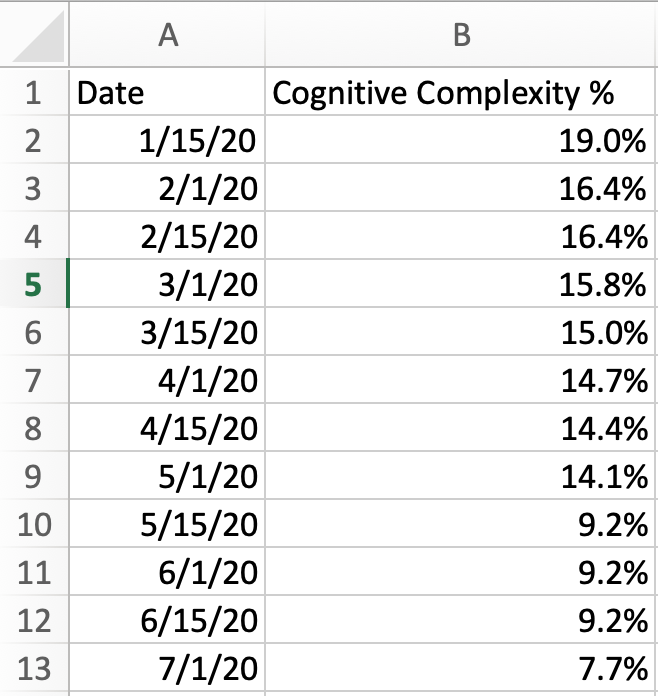

# Directional Code Health Metrics 

These notes accompany a presentation on the subject of *directional code health metrics*.

## 1. Context 

When software development teams seek to improve their delivery effectiveness, they need a way to show progress, both for their own benefit and to demonstrate to their management and stakeholders that things are improving. 

## 2. Problems 

These are common problems in measuring and tracking progress with technical improvement on software development teams. 

### 2.1. Measuring Activity vs. Outcomes

People tend to focus on *activity* rather than *outcomes* to judge whether the team is making progress.

**Examples:** 

- Does the team sit together?
- Is the team using Specification by Example?
- Is the team using Test-Driven Development?
- Does the team have a code review before closing User Stories? 

### 2.2. Misleading or Useless Information 

People often use inappropriate metrics or inadvertently create incentives to game the numbers.

**Examples:** 

- Is unit test coverage at least 70%?
- Does the team use Pair Programming at least 50% of the time? 

### 2.3. Delayed and Abstract Measurements 

People tend to check progress at *milestones* by running down a checklist of activities and (sometimes) outcomes. Often, the milestones are months apart. A checklist-based assessment doesn't provide meaningful information about progress. 

**Examples:**  

- January's checklist: 4 out of 20 items checked off.  
- April's checklist: 6 out of 20 items checked off.  
- July's checklist: 11 out of 20 items checked off. 

### 2.4. Lack of Psychological/Political Safety

Measurements of the code base almost always identify individual developers, as there is a connection between specific code snippets and particular commits to version control. This causes team members to be defensive and hide information or game the numbers. 

**Examples:**  

- Security vulnerability detected in code Narender committed on February 9. 
- Cyclomatic Complexity threshold exceeded in code Allison committed on February 13. 
- Unsafe endpoint detected in code Ming committed on March 3. 

##  3.Solution 

A solution to these problems is to use *directional code health metrics* to monitor progress with technical improvement. The premise is that improvements in software development methods, delivery processes, and technical practices will result in measurable improvement in the code base. 

Therefore, we want to assess the code base rather than focusing on any particular methods or practices. If the code base is improving, then the team is doing better work. 

### 3.1. What's *Code Health*?

A "healthy" code base can be understood and supported without excess stress, time, or effort beyond that resulting from the natural complexity of the solution. 

### 3.2. How Can We Measure Code Health?

The characteristics of a healthy code base manifest in several ways:

- *Development Process*: Changes to the solution require less time than before.
- *Production Support*: Production support activities require less time than before.
- *Source Code*: The source code reflects improved design over time. 

We want to select a small number of key measures rather than getting carried away with metrics. 

#### 3.2.1. Development Process: Mean Cycle Time 

Problems addressed: 2.1, 2.2, 2.3, 2.4.

*Cycle Time* is the elapsed time from the moment the team begins work on an item until the team completes its portion of the work on the item. 

*Mean* Cycle Time is essentially the average time the team takes to complete a work item. 

The team may choose to measure Cycle Time separately for different types of work items that have different characteristics. In a Lean-based process, these might be called *classes of service*. Teams using other kinds of processes may use different names. 

The premise is that as the code base improves, the team will require less time to make changes and test the changes adequately. 

#### 3.2.2. Production Support: Mean Time To Repair 

Problems addressed: 2.1, 2.2, 2.3. 

The *mean time to repair* is similar to mean Cycle Time, but for production support issues rather than planned modifications to the system. 

The premise is that as the code base improves, the team will be able to diagnose and correct issues and test the corrections in less time than before. 

**Note:** Counting the number of production support tickets does not tell us anything about the health of the code base. Most tickets are opened for reasons unrelated to the health of the code base, such as

- emergent behaviors of a complex execution environment that can't be anticipated or simulated prior to deployment;
- incorrect configuration settings for environments, servers, databases, or other components; and 
- misunderstood requirements. 

While those problems must be addressed, they are not directly related to the health of the application code base, and therefore can't serve as indicators of technical improvement. 

#### 3.2.3. Source Code: Static Code Analysis 

Problems addressed: 2.1, 2.2, 2.3. 

Static code analysis tools provide information about the structure of the source code. They can detect a wide range of issues and potential issues by examining the source code statically (that is, without executing it). 

Tools of this kind are routinely included in the *continuous integration/continuous delivery pipeline* for delivering changes to applications. That makes it relatively convenient to collect the raw data for tracking progress with technical improvement.

### 3.3. What's *Directional*? 

Problems addressed: 2.3.

A *directional* metric comprises a series of observations of the same measurement over time. We are looking for trends in the data that indicate the health of the code base is improving. 

This addresses problem 2.3 (delayed measurement) because the raw data can be collected nearly continuously. We don't wait for milestones to assess progress against a checklist. 

### 3.4. Aggregating the Data 

Problems addressed: 2.4. 

As we're interested in trends over time, we need aggregated data from static code analysis tools. Such tools are generally used to pinpoint specific issues in the code so that people can make spot corrections (for example, to remove a security vulnerability, remediate a long method, or consolidate duplicate code). 

We intend to use the same raw data for a different purpose. We will select just a few analysis rules and track their change over time. We want to select rules that are pertinent to the code base at hand. 

Consultant Patrick Welsh came up with a way to represent this information that does not point fingers at individual developers. 

When a rule violation is detected, we determine the number of source lines in the *source unit* that contains the offending code snippet. 

For example, SonarQube reports that class BookHelper from the Java project https://github.com/neopragma/java-bookstore needs a private constructor to hide the implicit public one: 


To get the data into the aggregated form we want, we need to calculate the number of source lines in this source unit. For this example, we're using the "class" as the source unit. For Java, we could also use the "method" as the source unit, depending on the level of granularity we want to track. 

For other languages, we would choose source units that make sense; possibly *modules* for F#, *programs* for COBOL, *modules* for Ruby, *classes* or *methods* for C#, and so on.

To get the number of lines in the BookHelper class, we have to write code to count the lines from the *class* declaration to the closing curly brace. In this example, that's 50 lines. 

SonarQube reports the total number of source lines in the project is 568:


Based on this single measurement, the percentage of source code that lives in offending source units is 0.88%. There are other violations in this code base, so the total percentage will be higher once all the calculations have been done. 

With this approach, we can track changes in "code health" (as measured by the analysis rules we select) without any way to identify individual developers. No one can be "blamed" for anything. 

## 4. Collecting the Data 

Most of the data we need to track improvements in code health directionally can be obtained from tools we're already using. The static code analysis data may require some custom coding on our part, depending on the kinds of data our static code analysis tool emits.  

### 4.1. Mean Cycle Time 

If the team is using a kanban or kanban-like system, then they already have tooling in place to capture the cycle time for each work item (User Story, task, or whatever). Whether using tactile or electronic tools, each time a work item changes state, the team is capturing the timestamp for that change. 

Assuming they are using the kanban system properly, a work item never moves backward in the system. They can calculate the Cycle Time for each work item by subtracting the timestamp when the item entered the first value-add state from the timestamp when the item moved to Done. 

Some electronic project management tools emit this information as a standard report. Here's an example from VersionOne, found at https://getnave.com/cycle-time-histogram-for-versionone. 


The tool lets you filter the output by classes of service, which it calls "Labels" (right-hand side of screenshot). The example shows Cycle Times for all classes of service.

Back-flows are an indication of a possible process improvement, but that doesn't mean a team will be able to eliminate them quickly or easily. They may be part of the team's reality, at least for a while. 

If the team's process has back-flows in it, then their visualization of the process has to support back-flows. Be aware that electronic kanban tools will lose track of the timestamps when you move an item backward on the board, so you'll have to capture the original timestamp for the item manually. Otherwise, the calculated Cycle Time for the item will only reflect its final pass through the system. 

The mean Cycle Time is the average of these individual Cycle Time observations, possibly segregated by class of service, if that makes sense for the particular team. 

### 4.2. Mean Time To Repair 

If the team is a cross-functional team with end-to-end responsibility for the product, then *mean time to repair* is nothing more than *mean Cycle Time* for production support tickets. They can collect the raw data in the same way as they do for planned work items. 

In a more traditional environment, production support may be handled by a separate group or team. In that case, they may be using a traditional issue tracking system rather than a project management system or kanban board. The *mean time to repair* will be the average of the individual repair times, calculated by subtracting the timestamp when the ticket was opened from the timestamp when it was closed. 

### 4.3. Static Analysis Rules 

Choose static analysis rules that will help you track improvements in the code base you're working with. There's no "stock" answer for which rules will make sense in every case. 

For this example, I chose *Cognitive Complexity* only. In real life, I might also choose one from the "security vulnerability" category and one from the "bugs" category, but I would avoid using a large number of rules. You already have a sense of what kinds of problems your code base has, so you can select rules that help you. 

### 4.4. Collecting Static Analysis Data 

We want to collect the data routinely and automatically as part of our delivery process. To do that, we can't look at HTML pages, as in the examples above. SonarQube exposes APIs we can use to collect the data we need. Other static analysis tools may do so, as well. 

Consult the documentation for the tool you're using to see how to pull data from it. 

I used SonarQube for these examples. To set up the Bookstore project, I connected it to my Sonar Cloud account. 

Next, I decided which rules to use to track code health. For this example, I chose *Cognitive Complexity*. 


You will have to set up a SonarQube scan in your build. For the Bookstore project, I had to modify the build script to include SonarQube analysis. I made these changes to the build.gradle file:

```
buildscript {
    . . .
    dependencies {
        . . .
        classpath 'org.sonarsource.scanner.gradle:sonarqube-gradle-plugin:2.7'
        . . .
    }
}

    . . .

apply plugin: 'org.sonarqube'
```

Then I ran the analysis like this: 

```shell 
./gradlew sonarqube \
  -Dsonar.projectKey=neopragma_java-bookstore \
  -Dsonar.organization=neopragma-github \
  -Dsonar.host.url=https://sonarcloud.io \
  -Dsonar.login=[secret login key here]
```

At that point, Sonar Cloud had the data from the analysis in its database. I could use the API to extract some of that data, like this (it's all one line, broken up here for readability):

```shell 
curl -u [secret login key here]:  
"https://sonarcloud.io/api/  
measures/component_tree  
?component=neopragma_java-bookstore  
&metricKeys=cognitive_complexity,  
ncloc&qualifiers=FIL" | jq
```

This requests the results for *Cognitive Complexity* and the *total source line count*. 

I piped the output through jq so I could read it on the console. When you write the custom code to consume the data, you won't need to do that. This is only for purposes of illustration. 

Here's part of the output from that request. The output is quite long, even though this is a small "toy" project. 

```shell 
{
  "paging": {
    "pageIndex": 1,
    "pageSize": 100,
    "total": 14
  },
  "baseComponent": {
    "id": "AWqx1WQSgvTe5u3ZToid",
    "key": "neopragma_java-bookstore",
    "name": "bookstore",
    "description": "World's Smallest Bookstore",
    "qualifier": "TRK",
    "measures": []
  },
  "components": [
    {
      "id": "AWqx6DgGmUFavHkbQcCh",
      "key": "neopragma_java-bookstore:src/main/java/com/leadingagile/bookstore/helpers/ApiHelper.java",
      "name": "ApiHelper.java",
      "qualifier": "FIL",
      "path": "src/main/java/com/leadingagile/bookstore/helpers/ApiHelper.java",
      "language": "java",
      "measures": [
        {
          "metric": "cognitive_complexity",
          "value": "1",
          "bestValue": false
        },
        {
          "metric": "ncloc",
          "value": "32"
        }
      ]
    },
    {
      "id": "AWqx6DgGmUFavHkbQcCq",
      "key": "neopragma_java-bookstore:src/main/java/com/leadingagile/bookstore/model/Author.java",
      "name": "Author.java",
      "qualifier": "FIL",
      "path": "src/main/java/com/leadingagile/bookstore/model/Author.java",
      "language": "java",
      "measures": [
        {
          "metric": "cognitive_complexity",
          "value": "4",
          "bestValue": false
        },
        {
          "metric": "ncloc",
          "value": "120"
        }
      ]
    },
. . .
```

There's quite a bit more output that looks similar. The main things to notice here are: 

- Each Java class is treated as a "component." 
- Your code will have to examine the *value* value under *"metric": "cognitive_complexity"* to determine which components are problematic.
- Your code will have to accumulate the *value* values under *"metric": "ncloc" for each problematic component to get the number of lines to use for the percentage calculation.
- Your code will have to accumulate the *value* values under *"metric": "ncloc" for all components that have *"language": "java"* to calculate the total lines of code. 

Here's how you might record the calculated percentages for several observations. 



Then you can use your spreadsheet's charting feature to visualize the trend: 


The trend is downward, which is the right *direction*. Hence the name, *directional metric*.

